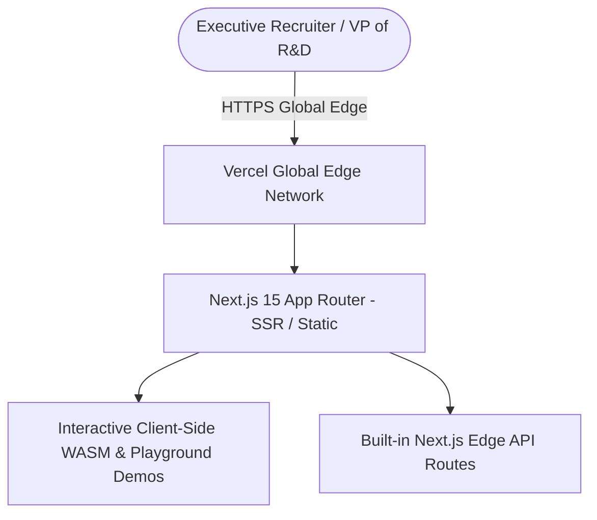

# Executive AI & Full-Stack Digitalization Portfolio Website

[](https://nextjs.org)
[](https://tailwindcss.com)
[](https://www.typescriptlang.org/)
[](https://vercel.com)

> **Interactive Engineering Portfolio & System Showcase** for Senior AI Adoption Consultants, R&D AI Product Owners, and Lead Full-Stack Digitalization Architects. 

---

## 🌟 What Makes This Portfolio Stand Out to Headhunters & Recruiters

Most portfolios are static marketing blogs. This portfolio is designed as an **Interactive Enterprise Cockpit**:
1. **Embedded Live Sandboxes:** Live interactive demos of the Polymer Materials Search, SDS Agent Compliance Checker, and Tensile Curve Plotter directly on the page.
2. **Interactive Cloud Topology Visualizer:** Clickable architectural diagrams showing AWS ECS, Azure AI Foundry, Redis caching, and microservice communication.
3. **Verified Business ROI Dashboard:** Prominently highlights **€1.2M+ in vendor cost savings**, 99.95% system uptime, and 2.4x R&D team productivity acceleration.
4. **ATS & Recruiter Direct Access:** One-click download of ATS-compliant CV, targeted Cover Letters, and contact modals.

---

## 🏗️ Architecture & Deployment



---

## 🚀 Deployment to Vercel (Step-by-Step)

Deploy in under **3 minutes** for free with custom domain and automatic SSL:

1. **Push to GitHub:**
   ```bash
   git init
   git add .
   git commit -m "feat: initial executive portfolio release"
   git remote add origin https://github.com/your-username/portfolio-website.git
   git push -u origin main
   ```
2. **Import to Vercel:**
   * Go to [https://vercel.com/new](https://vercel.com/new).
   * Select your `portfolio-website` repository.
   * Framework Preset: **Next.js** (auto-detected).
   * Click **Deploy**.
3. **Custom Domain:**
   * In Vercel Project Settings $\rightarrow$ Domains $\rightarrow$ Add your domain (e.g. `yourname.dev` or `yourname-ai.de`).

---

## ⚡ Quickstart (Local Development)

```bash
# 1. Install dependencies
npm install

# 2. Run local dev server
npm run dev

# 3. Open browser at http://localhost:3000
```
