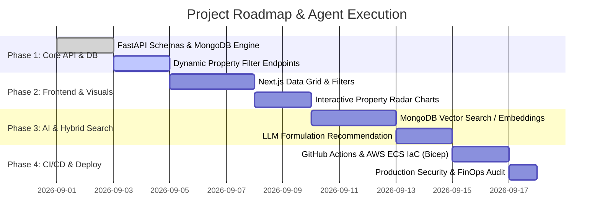

# Step-by-Step Implementation Plan: Materials Intelligence Platform

This plan is structured for autonomous and assisted development using **GitHub Copilot** or **Claude Code subagents** to bring the platform from foundation to high-scale production readiness.

---

## 📋 Milestones & Phase Breakdown

---

## 🤖 Prompts for GitHub Copilot & Coding Agents

### Step 1: Complete FastAPI Endpoints & Async CRUD
**Agent Prompt:**
> *"Implement the full asynchronous CRUD router in `backend/app/routers/materials.py` for polymer material specifications. Support multi-field range filtering (tensile modulus min/max, melt temperature, shore hardness), text search, and pagination. Ensure all responses validate against Pydantic v2 schemas and include cache headers with Redis."*

### Step 2: Implement Audit Log & Optimistic Concurrency
**Agent Prompt:**
> *"Add an audit log middleware in `backend/app/middleware/audit.py` that intercepts all POST, PUT, and DELETE operations on materials. Store the previous snapshot and new snapshot in a dedicated `material_audit_logs` collection in MongoDB with timestamp, user ID, and diff JSON."*

### Step 3: Scaffold Next.js 15 Data Explorer & Radar Comparison
**Agent Prompt:**
> *"Build a Next.js 15 client component `frontend/src/components/MaterialComparisonMatrix.tsx` using Tailwind CSS and Recharts. Allow users to select up to 3 materials from the grid and display their mechanical properties (Tensile Modulus, Elongation at Break, Charpy Impact, HDT, Density) on an interactive radar chart with comparative percentage diffs."*

### Step 4: Add Automated Integration Tests & Coverage Badges
**Agent Prompt:**
> *"Write comprehensive Pytest integration tests in `tests/test_materials_api.py` covering unauthorized access attempts, invalid property range queries, and concurrent update race conditions using `httpx.AsyncClient`."*

---

## 🔒 Verification & Quality Gates
1. **Test Coverage:** Minimum 90% backend branch coverage via `pytest-cov`.
2. **Security:** Snyk/Trivy container scan in GitHub Actions with 0 High/Critical CVEs.
3. **Performance SLA:** P99 response time `< 50ms` on material queries up to 100 concurrent requests.
