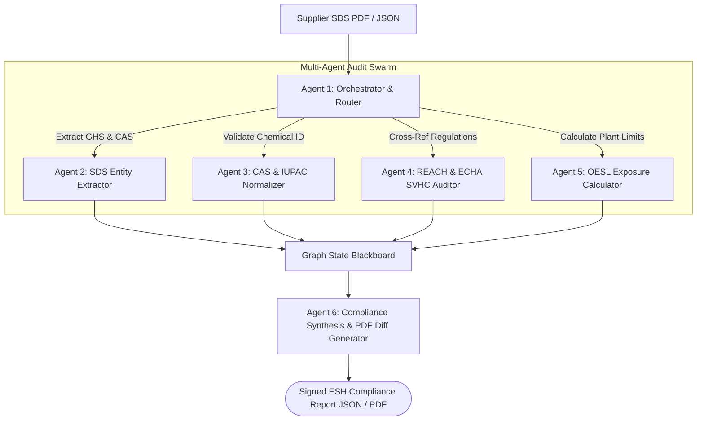

# ChemAgent-Gov: Autonomous Multi-Agent SDS & REACH Compliance Auditor

[](https://github.com/your-org/chemagent-sds-compliance/actions)
[](https://langchain-ai.github.io/langgraph/)
[](https://python.org)
[](https://fastapi.tiangolo.com)
[](https://docker.com)

> **Autonomous Multi-Agent AI System** for parsing chemical Safety Data Sheets (SDS), auditing European Chemicals Agency (ECHA) REACH SVHC restrictions, and calculating Occupational Exposure Scenario Limits (OESL/OESM) for production plants.

---

## 🌟 Executive Summary & Impact

* **Audit Velocity:** Cuts chemical compliance verification from **4 hours per supplier SDS to under 12 seconds**.
* **Risk Mitigation:** Real-time flagging of EU REACH Annex XIV candidate substances (SVHC) and hazardous GHS statements before raw materials enter plant supply chains.
* **Architecture:** Multi-agent supervisor-worker graph with deterministic regulatory fallbacks (eliminates LLM hallucinations for chemical toxicity).

---

## 🏗️ Multi-Agent Architecture



---

## 🚀 Key Features

1. **Deterministic Regulatory Engine:** Ingests ECHA REACH SVHC lists directly into a containerized local database.
2. **LangGraph State Graph:** Multi-step agent graph featuring cyclic review, human-in-the-loop review triggers for high hazard thresholds ($H350, H360$), and strict JSON schema output.
3. **Local Vector Store:** ChromaDB/SQLite storage with pre-seeded chemical occupational health monographs.
4. **Zero-Cloud Local Mock Mode:** Operates with simulated LLM embeddings and LLM providers for offline CI/CD and local evaluation.

---

## ⚡ Quickstart & Local Execution

```bash
# 1. Clone repository
git clone https://github.com/your-username/chemagent-sds-compliance.git
cd chemagent-sds-compliance

# 2. Launch multi-agent service
docker compose up --build

# 3. Access Swagger API & Agent Trigger:
# - API Documentation: http://localhost:8001/docs
# - Trigger Audit: POST http://localhost:8001/api/v1/audit/sds
```
