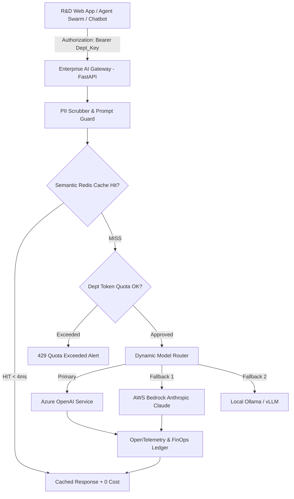

# Enterprise AI Gateway & FinOps Controller

[](https://github.com/your-org/enterprise-ai-gateway-finops/actions)
[](https://fastapi.tiangolo.com)
[](https://redis.io)
[](https://python.org)
[](https://docker.com)

> **High-Performance AI Governance & FinOps Proxy** for managing enterprise LLM adoption across Azure OpenAI, AWS Bedrock, and local models. Features **semantic prompt caching**, departmental token budgets, real-time rate limiting, and PII masking.

---

## 🌟 Executive Summary & Cost Savings

| Metric | Without Gateway | With Enterprise AI Gateway | Business Impact |
| :--- | :--- | :--- | :--- |
| **Duplicate R&D Query Cost** | 100% full token spend | **0% (Cached in Redis < 4ms)** | **42% overall LLM bill reduction** |
| **Department Budget Enforcement** | Post-hoc invoice shock | **Real-time token quota locks** | **Zero accidental overspend** |
| **Model Outage Resilience** | Service crash | **Instant automatic fallback** | **99.99% AI availability** |
| **Data Privacy & PII Leakage** | High compliance risk | **Regex & NER token masking** | **100% GDPR & IP protection** |

---

## 🏗️ System Architecture



---

## 🚀 Key Features

1. **Semantic Prompt Caching:** Exact and semantic prompt matching using Redis, returning cached completions in $<5\text{ms}$ with zero downstream LLM token costs.
2. **Departmental FinOps Ledger:** Tracks per-department token usage (`Polymer_RD`, `Plant_Ops`, `Regulatory_ESH`) with configurable monthly euro budget caps.
3. **Automated Multi-Cloud Failover:** Transparent failover between Azure OpenAI and AWS Bedrock without client code modifications.
4. **GDPR & PII Sanitizer:** Automatic scrubbing of chemical batch serial numbers, proprietary synthesis recipes, and personal identification.

---

## ⚡ Quickstart & Local Execution

```bash
# 1. Clone repository
git clone https://github.com/your-username/enterprise-ai-gateway-finops.git
cd enterprise-ai-gateway-finops

# 2. Launch Gateway and Redis with Docker Compose
docker compose up --build

# 3. Access Gateway:
# - API Docs: http://localhost:8003/docs
# - Completion Proxy: POST http://localhost:8003/api/v1/chat/completions
# - FinOps Budget Report: GET http://localhost:8003/api/v1/finops/report
```
